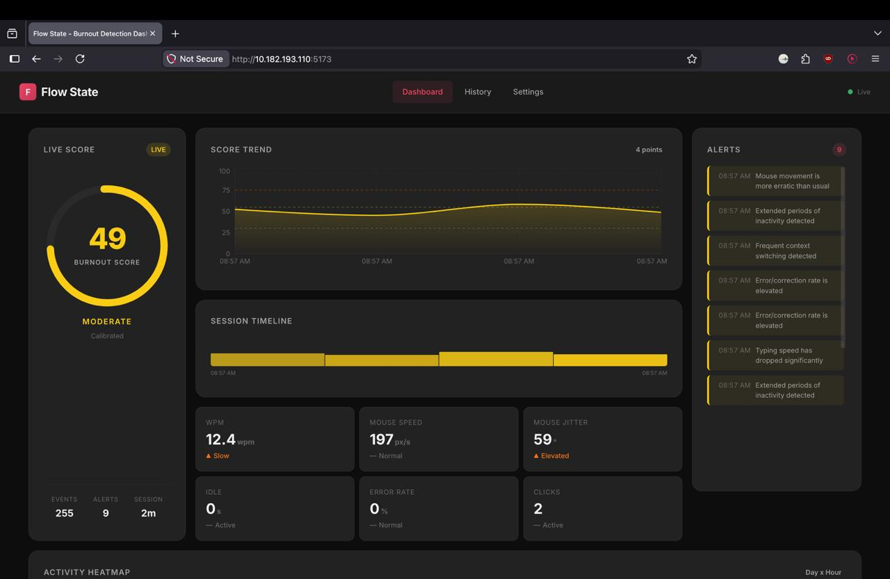

# Flow-State — Burnout Radar

> **Built by Team CodeFusion**

Flow-State is a **real-time cognitive burnout detection system** powered by behavioural biometrics. It passively monitors mouse movement, typing dynamics, and session patterns to estimate cognitive fatigue and burnout risk — all without ever recording what you type or seeing your screen.

---

## Screenshots
Example usage once you add screenshots:


Data Collection (Local):


---

## How It Works — The Algorithm Pipeline

Flow-State runs a **4-stage pipeline** from raw OS events to a live burnout score on your dashboard.

```
OS Input Events (mouse / keyboard)
         │
         ▼
   [ 1. Data Collection Agent ]
   Captures movements, clicks, keystrokes (no content), scrolls
         │
         ▼
   [ 2. Feature Extraction ]
   Computes 11 behavioural metrics per 30-second window
         │
         ▼
   [ 3. Burnout Scoring Model ]
   Weighted heuristic → Sigmoid normalisation → EMA smoothing
         │
         ▼
   [ 4. Real-Time Dashboard ]
   WebSocket stream → Score gauge, trends, heatmap, recommendations
```

---

### Stage 1 — Behavioural Data Collection (`agent/real_tracker.py`)

The agent attaches **OS-level hooks** (via `pynput`) to capture:

| Signal | What is captured | Privacy |
|---|---|---|
| Mouse movement | XY coordinates, direction angle changes | No content |
| Mouse clicks | Click count per window | No content |
| Mouse scroll | Total scroll units, direction reversals | No content |
| Keyboard | Key count (alphanumeric only), backspace count, inter-key gaps | **Content is NEVER recorded** |
| Task switching | Alt+Tab events counted as switches | No content |

Every **N seconds** (configurable, default 5s), the agent harvests all accumulated events into a single JSON payload and sends it to the backend via HTTP POST.

#### Calibration Phase
Before tracking begins, the agent runs a **personal calibration window** (default: 7 seconds). During this phase, data is collected silently and used to establish *your* personal baseline: typical WPM, mouse speed, and jitter. Subsequent readings are then normalized relative to this baseline, making the score adaptive to each individual rather than using universal thresholds.

---

### Stage 2 — Feature Extraction (`backend/features.py`)

The raw event payload is transformed into an **11-dimensional feature vector**:

| Feature | Description | Direction |
|---|---|---|
| `mouse_jitter_zscore` | Mean angular change in mouse direction (deviation from baseline) | ↑ = fatigue |
| `mouse_speed_zscore` | Mouse movement speed deviation from baseline | Anomaly = stress |
| `wpm_zscore` | Typing speed deviation from baseline | ↓ = fatigue |
| `backspace_zscore` | Error/correction rate deviation from baseline | ↑ = mental load |
| `idle_ratio` | Fraction of window spent idle | ↑ = disengagement |
| `idle_zscore` | Unusual idle patterns vs baseline | Anomaly = break in rhythm |
| `late_hour_flag` | Boolean: working after 9 PM | 1.0 = burnout risk |
| `task_switch_rate` | Alt+Tab switches per active minute | ↑ = fragmentation |
| `scroll_backtracks` | Number of scroll direction reversals | ↑ = comprehension drop |
| `clicks` | Total mouse clicks | ↑ = engagement (negative signal) |
| `scroll_depth_pct` | Total scroll depth (0–1 scale) | ↑ = engagement (negative signal) |

#### Z-Score Normalisation
Once a **personal baseline** is established (after ~20 event windows, ~10 minutes), all continuous metrics are **z-score normalized** against the user's own historical mean and standard deviation:

```
z = (current_value − personal_mean) / personal_std
z = clamp(z, −2.0, +2.0)   ← dampens outlier spikes
```

Before the baseline is ready, a set of **cold-start heuristics** applies predefined thresholds (e.g., typing speed is penalized only when the user is actively typing but very slowly; idle is only flagged when >85% of the window is idle).

---

### Stage 3 — Burnout Scoring Model (`backend/model.py`)

#### Weighted Heuristic Model
Each feature is multiplied by a hand-tuned weight that reflects how much it contributes to burnout:

```python
FEATURE_WEIGHTS = {
    "mouse_jitter_zscore":  +8.0,   # erratic movement → stress/fatigue
    "wpm_zscore":           +7.0,   # slow typing → fatigue
    "backspace_zscore":     +8.0,   # high error rate → mental fatigue
    "idle_ratio":           +2.0,   # disengagement
    "idle_zscore":          +3.0,   # unusual idle → lost rhythm
    "late_hour_flag":       +6.0,   # working late → burnout risk
    "task_switch_rate":     +5.0,   # context fragmentation
    "scroll_backtracks":    +3.0,   # re-reading → comprehension drop
    "mouse_speed_zscore":   +3.0,   # erratic speed → stress
    "clicks":               −2.0,   # more clicks → engagement (reduces score)
    "scroll_depth_pct":     −3.0,   # deep scroll → engagement (reduces score)
}
raw_score = Σ (feature_value × weight)
```

#### Sigmoid Normalisation
The raw weighted sum is mapped to a **0–100 burnout score** using a shifted sigmoid function:

```
score = 100 / (1 + e^(−0.04 × (raw_score − 30)))
```

- The **−30 shift** centers the sigmoid so neutral/idle behaviour lands around 20–25 (not 50), preventing false positives when the user simply isn't very active.
- The **0.04 steepness** creates a gradual slope so minor fluctuations don't spike the gauge.

#### Exponential Moving Average (EMA) Smoothing
To prevent the displayed score from jumping erratically on every data point, each user's score is passed through a **per-user EMA smoother**:

```
smoothed = α × raw_score + (1 − α) × previous_smoothed
α = 0.25
```

With α = 0.25: the current measurement contributes 25%, while the rolling history contributes 75%, giving a stable and gradual gauge response.

#### Severity Classification
The final score maps to four severity bands:

| Score | Severity | Colour |
|---|---|---|
| 0 – 40 | 🟢 Low | `#4ade80` |
| 41 – 62 | 🟡 Moderate | `#facc15` |
| 63 – 80 | 🟠 High | `#f97316` |
| 81 – 100 | 🔴 Critical | `#ef4444` |

The model also identifies the **top 3 contributing factors** and surfaces human-readable explanations for each (e.g., *"Typing speed has dropped significantly"*).

---

### Stage 4 — Real-Time Dashboard (`dashboard/`)

The React dashboard connects to the backend via a **WebSocket** and renders:

- **Score Gauge** — Animated 0–100 dial with severity colour coding
- **Trend Chart** — Time-series line chart (Recharts) showing score history over 1h / 6h / 1d / 7d
- **Activity Heatmap** — 7×24 day-of-week × hour-of-day grid showing when burnout risk peaks
- **Factor Cards** — Top contributing signals with plain-language explanations
- **Recommendations** — Adaptive suggestions based on severity band
- **Calibration Indicator** — Shows personal baseline readiness progress

---

## Tech Stack

### Backend
| Technology | Role |
|---|---|
| **Python 3.9+** | Core language |
| **FastAPI** | REST API + WebSocket server |
| **Uvicorn** | ASGI web server |
| **SQLModel** | ORM layer over SQLite |
| **SQLite** | Lightweight embedded database |
| **NumPy** | Z-score computation, sigmoid function |
| **WebSockets** | Real-time score push to dashboard |

### Frontend Dashboard
| Technology | Role |
|---|---|
| **React 18** | UI component framework |
| **Vite** | Lightning-fast dev server & bundler |
| **Recharts** | Score trend & heatmap charts |
| **Framer Motion** | Smooth animations and transitions |
| **React Router v6** | Client-side routing |
| **CSS (Vanilla)** | Custom dark-mode design system |

### Agent (Data Collector)
| Technology | Role |
|---|---|
| **Python 3.9+** | Core language |
| **pynput** | Cross-platform OS-level mouse & keyboard hooks |
| **Tkinter** | GUI control panel (tracker_gui.py) |
| **requests / httpx** | HTTP payload delivery to backend |
| **threading** | Concurrent event capture and reporting |

---

## Quick Start

### Prerequisites
- **Node.js** v16+
- **Python** 3.9+

---

### Option A — Single Command (Recommended)

From the `dashboard/` folder, one command starts **everything** — backend, agent GUI, and the Vite dev server:

```bash
cd burnout-radar/dashboard
npm install
npm run dev
```

This uses `concurrently` to spin up:
- 🔵 **Backend** → `http://localhost:8000`
- 🟣 **Agent GUI** → Tkinter tracker window
- 🟢 **Dashboard** → `http://localhost:5173`

---

### Option B — Manual (Three Separate Terminals)

#### Terminal 1 — Backend Server

```bash
cd burnout-radar/backend
pip install -r requirements.txt
python -m uvicorn main:app --reload --port 8000
```

#### Terminal 2 — Frontend Dashboard

```bash
cd burnout-radar/dashboard
npm install
npm run vite
```

#### Terminal 3 — Data Agent

**Real tracker** (uses your actual mouse/keyboard — privacy-safe):
```bash
cd burnout-radar/agent
pip install -r requirements.txt
python real_tracker.py --user demo --interval 5
```

Or use the **GUI tracker** with a control panel:
```bash
python tracker_gui.py
```

Or run the **simulator** (generates synthetic data for demo):
```bash
python simulate.py --user demo --scenario ramp --duration 300 --interval 3
```

---

### Simulator Scenarios

| Scenario | Score Range | Description |
|---|---|---|
| `normal` | 15–30 | Stable, healthy working patterns |
| `fatigue` | 40–55 | Gradually slowing down |
| `burnout` | 65–85 | Erratic, high-error behaviour |
| `crisis` | 85–100 | Near-zero productivity |
| `ramp` | 15→100 | Gradually transitions from normal to crisis over the session |

```bash
python simulate.py --user demo --scenario ramp --duration 300 --interval 3
```

---

## API Reference

| Endpoint | Method | Description |
|---|---|---|
| `/ingest` | POST | Receive raw event window from agent |
| `/score/{user_id}` | GET | Latest burnout score for a user |
| `/history/{user_id}` | GET | Historical scores (supports `?range=1h\|6h\|1d\|7d\|30d`) |
| `/factors/{user_id}` | GET | Top contributing factors from latest score |
| `/heatmap/{user_id}` | GET | 7×24 activity heatmap grid |
| `/calibration/{user_id}` | GET | Baseline calibration status |
| `/calibrate/reset` | POST | Reset personal baseline |
| `/ws/{user_id}` | WS | Real-time WebSocket stream |
| `/health` | GET | Server health check |

Interactive API docs available at: `http://localhost:8000/docs`

---

## Privacy by Design

- ❌ **No keystroke content** is ever captured, stored, or transmitted
- ❌ **No screen recording** or application monitoring
- ✅ Only **counts and timing** are measured (how many keys, how fast, not which keys)
- ✅ All data stays **100% local** — nothing leaves your machine
- ✅ SQLite database is stored locally at `backend/burnout_radar.db`

---

## Project Structure

```
burnout-radar/
├── backend/
│   ├── main.py           # FastAPI app, all routes & WebSocket endpoint
│   ├── model.py          # Burnout scoring: weighted heuristic + sigmoid + EMA
│   ├── features.py       # Feature extraction & z-score normalisation
│   ├── calibration.py    # Personal baseline management (SQLite)
│   ├── database.py       # SQLModel ORM schema & DB init
│   ├── ws_manager.py     # WebSocket connection manager
│   └── requirements.txt
│
├── agent/
│   ├── real_tracker.py   # OS-level behavioural data collector (pynput)
│   ├── tracker_gui.py    # Tkinter GUI control panel for the tracker
│   ├── simulate.py       # Synthetic data simulator (demo scenarios)
│   └── requirements.txt
│
├── dashboard/
│   ├── src/
│   │   ├── App.jsx           # Root component & routing
│   │   ├── components/       # Score gauge, charts, factor cards, heatmap
│   │   ├── hooks/            # WebSocket hook, data fetching
│   │   ├── pages/            # Dashboard page layout
│   │   └── index.css         # Dark-mode design system
│   ├── package.json
│   └── vite.config.js
│
└── README.md
```

---

## Team CodeFusion

**Flow-State** was built during Technovate 3.0 hackathon to demonstrate that cognitive fatigue can be detected passively, non-invasively, and with full respect for user privacy — no surveys, no wearables, no content snooping. Just the subtle patterns in how you interact with your computer.
